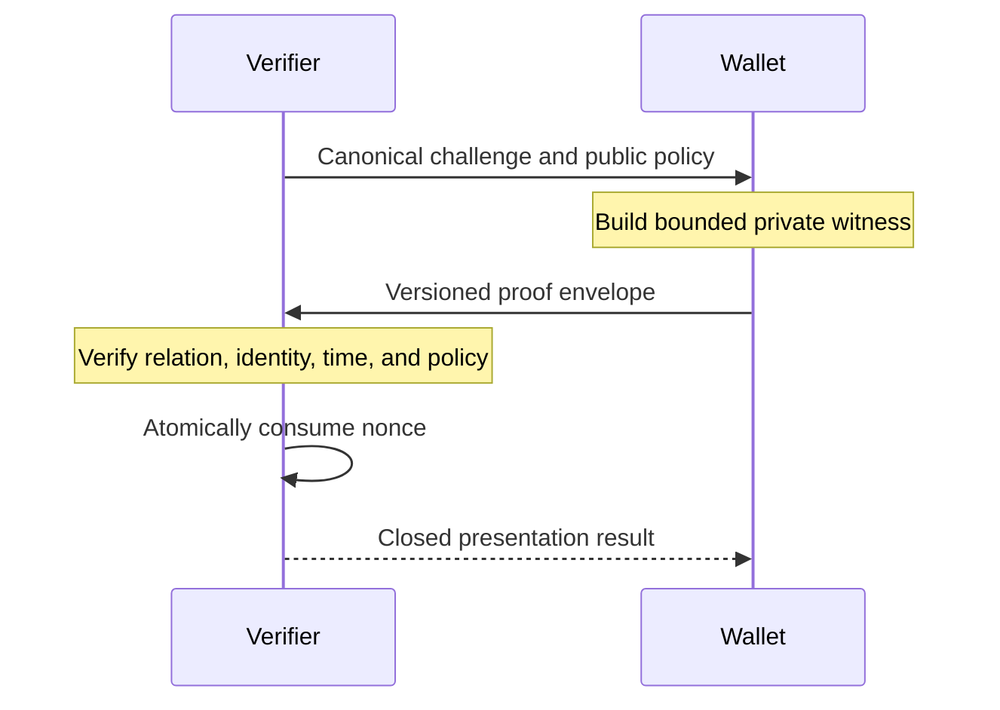

# Protocol

V1 is a verifier-led challenge protocol. The verifier fixes the public policy,
the wallet proves the matching bounded relation, and the verifier applies local
policy before consuming the challenge nonce.

## Challenge

The verifier creates a canonical challenge containing:

- the exact issuer P-256 public key;
- audience and purpose;
- a fresh nonce and accepted time window;
- bearer or holder-bound mode;
- the fixed claim policy and accepted circuit identity; and
- either status-forbidden or status-required policy with a trusted snapshot.

Audience and purpose are encoded as `audience || 0x1f || purpose`. Empty values
and embedded separator bytes are rejected. Changing either field changes the
request transcript.

## Prove

The wallet reads the credential and private witness material from protected
files. It proves the issuer signature, the exact two-disclosure shape, and the
claim relation. Holder-bound mode adds the KB-JWT relation. Status-required mode
adds the separate presentation-bound `VALID` membership component.

Witness bytes are not serialized into the public envelope. Credential files,
holder keys, status indices, and Merkle paths should never be placed in command
arguments or environment variables.

## Verify

The verifier decodes the canonical envelope, rejects malformed or unsupported
identities, and verifies it against the original typed request. Proof
verification happens before replay consumption. Only after every cryptographic
and local-policy check succeeds does `VerifyPresentation` atomically consume
the nonce.

Failed verification does not convert proof-supplied trust material into local
authority and does not release witness bytes. See [wallet and verifier
workflows](./workflows.md) for the operational file boundary.
