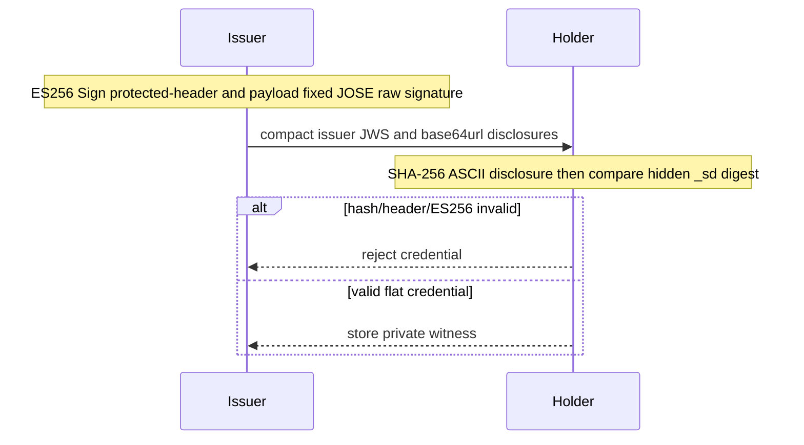
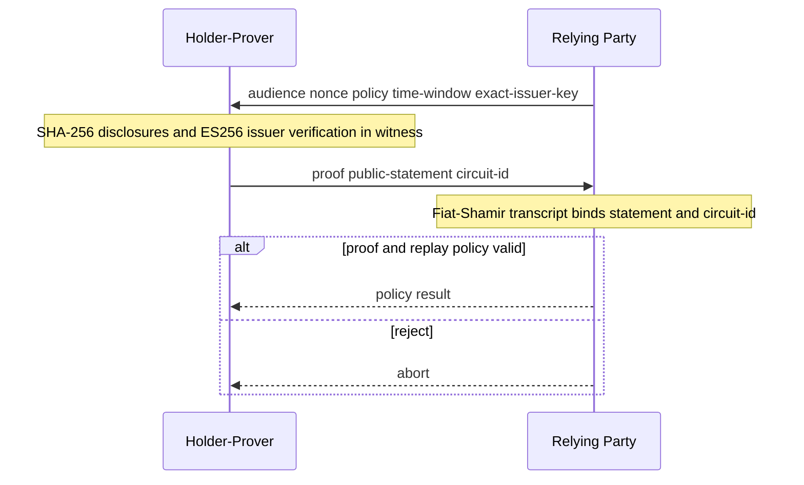
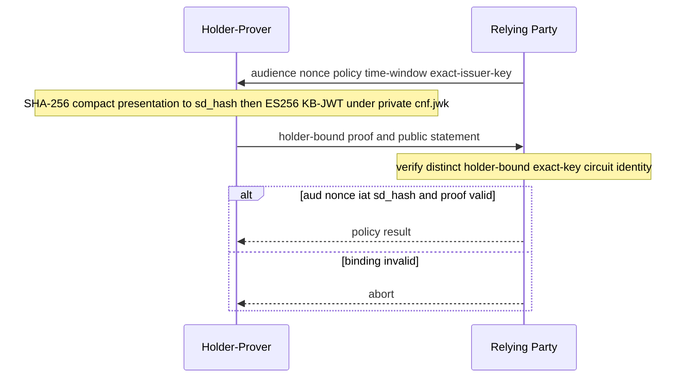
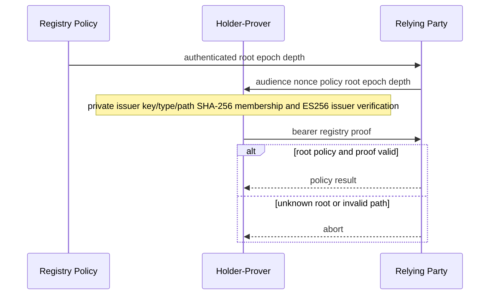
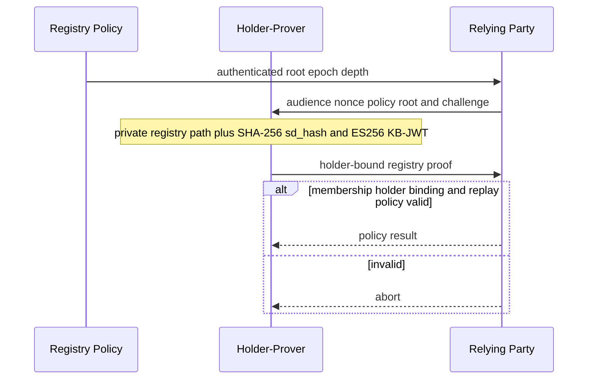
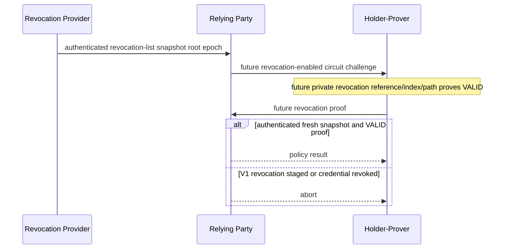

# SD-JWT-ZK V1 sequence diagrams

All arrows are logical deployment messages. Witness material stays local to the
holder/prover; ZK envelopes contain only the V1 public statement and proof.

## Issuance input

## Bearer exact-key presentation

## Holder-bound exact-key presentation

## Bearer registry-trust presentation

## Holder-bound registry-trust presentation

## Staged revocation extension

Protocol summary: six flows cover issuance input, both binding modes, both trust
modes, and the intentionally staged revocation extension. Primitives are ES256,
SHA-256, and a domain-separated Fiat-Shamir transcript. There is no forward
secrecy claim and all error branches reject without releasing witness bytes.
